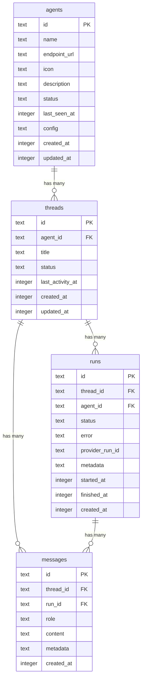

# Refactor Architecture for Pluggable AG-UI Agents with Turso Persistence

## Overview

Refactor the Agent UI from a CopilotKit + Supabase prototype with mock data into a durable, production-ready system where any AG-UI-compliant agent can be plugged in and used through a unified inbox. Replace CopilotKit with a custom AG-UI gateway, replace Supabase with Turso (libsql + Drizzle ORM), and wire all UI flows to real persistence.

## Problem Statement

The current codebase has the right architectural direction (protocol-first, decoupled agents) but critical pieces are disconnected:

1. **Messages are ephemeral.** CopilotKit's `useCopilotChat()` manages messages in-memory. All conversation history is lost on navigation or reload.
2. **Inbox uses mock data.** `InboxContent` renders hardcoded `mockThreads` array. The `useInbox` Supabase hook exists but is never imported.
3. **Thread-to-agent routing is fragile.** The thread page resolves agents from `?agent=` query params, falling back to the first agent in config. Navigating to `/thread/:id` without the param gives the wrong agent.
4. **No run tracking.** There is no record of when a run started, finished, or failed. Errors are silent.
5. **CopilotKit adds complexity without persistence.** Three packages, a `@ts-expect-error` suppression, `ExperimentalEmptyAdapter`, and duck-typing checks in `ChatThread.tsx` -- all to manage ephemeral state that needs to be durable.
6. **Supabase is heavier than needed.** For a single-user app, a managed Postgres instance with auth, RLS, and realtime is overkill. Turso (SQLite-based) is simpler, cheaper, and works locally as a file.

## Proposed Solution

### Architecture

```
┌──────────────────────────────────────┐
│           Agent UI (Next.js)          │
│                                      │
│  Inbox ─── Thread View ─── Sidebar   │
│                 │                    │
│           useAgentChat()             │
│                 │                    │
│        /api/gateway route            │
│          (AG-UI client)              │
│                 │                    │
│  ┌──────────────┴──────────────┐     │
│  │     Turso (libsql)          │     │
│  │  Drizzle ORM schema:        │     │
│  │  agents | threads | messages│     │
│  │  runs                       │     │
│  └─────────────────────────────┘     │
└─────────────┬────────────────────────┘
              │
              │  AG-UI protocol (SSE)
              │
    ┌─────────┼─────────┐
    ▼         ▼         ▼
┌────────┐ ┌────────┐ ┌────────┐
│Agent A │ │Agent B │ │Agent C │
│OpenCode│ │LangChn │ │Custom  │
│  SDK   │ │  SDK   │ │  SDK   │
└────────┘ └────────┘ └────────┘
```

### Agent contract

Any agent that exposes an HTTP endpoint speaking AG-UI protocol events (`RUN_STARTED`, `TEXT_MESSAGE_CONTENT`, `TEXT_MESSAGE_END`, `RUN_FINISHED`) works with this UI. The existing mock agent already implements this contract.

### Key decisions

| Decision           | Choice                | Rationale                                                                                 |
| ------------------ | --------------------- | ----------------------------------------------------------------------------------------- |
| Agent protocol     | AG-UI (SSE)           | Industry standard, SDK-agnostic, already proven by mock agent                             |
| Persistence        | Turso + Drizzle       | SQLite-based, local dev is a file, typed queries via Drizzle                              |
| CopilotKit         | Remove                | Ephemeral state conflicts with durability goal; `@ag-ui/client` handles protocol directly |
| Agent registration | Config file + DB sync | Simple starting point; agents.config.json synced to DB on startup                         |
| Deployment         | Phases 1-3 atomic     | Phase 1 breaks mock flow, so all three must ship together                                 |

## Technical Approach

### Data Model (Drizzle Schema)



**Key differences from current Supabase schema:**

- All IDs are `text` (UUIDs generated in application code via `crypto.randomUUID()`)
- Timestamps are `integer` (Unix milliseconds -- SQLite has no native timestamp type)
- `runs` table is new: tracks each agent invocation lifecycle
- `messages.run_id` links messages to the run that produced them
- `threads.status` enum: `active`, `completed`, `error`
- `runs.status` enum: `pending`, `running`, `completed`, `failed`, `cancelled`
- No `provider` / `provider_session_id` columns on threads (session management is agent-specific, not a UI concern -- agents manage their own state)

### Run State Machine

```
pending ──> running ──> completed
                   ──> failed
                   ──> cancelled
```

- `pending`: Run created, request not yet sent to agent
- `running`: `RUN_STARTED` event received from agent
- `completed`: `RUN_FINISHED` event received
- `failed`: Agent returned error, network timeout, or stream interrupted
- `cancelled`: User clicked stop, abort signal sent

### Implementation Phases

#### Phase 1: Data Layer -- Turso + Drizzle

Replace Supabase with Turso. Set up Drizzle schema, migrations, and database client.

**Files to create:**

- `db/schema.ts` -- Drizzle table definitions (agents, threads, messages, runs)
- `db/client.ts` -- Turso client + Drizzle instance
- `db/migrate.ts` -- Migration runner
- `drizzle.config.ts` -- Drizzle Kit configuration

**Files to delete:**

- `src/lib/supabase/client.ts`
- `src/lib/supabase/server.ts`
- `src/lib/hooks/useInbox.ts` (will be rewritten)
- `src/lib/hooks/useMessages.ts` (will be rewritten)
- `src/types/database.types.ts` (replaced by Drizzle schema types)

**Dependencies to add:**

- `@libsql/client` -- Turso client
- `drizzle-orm` -- Query builder and ORM
- `drizzle-kit` (dev) -- Migration generation and studio

**Dependencies to remove:**

- `@supabase/ssr`
- `@supabase/supabase-js`

**Agent config sync:** On server startup (or as a build step), read `agents.config.json` and upsert each agent into the `agents` table. This ensures the DB always reflects the config file. The gateway route calls this before handling requests.

```typescript
// db/sync-agents.ts
import { db } from "./client";
import { agents } from "./schema";
import { loadAgentsConfig } from "@/lib/agents";

export async function syncAgentsToDb() {
  const config = loadAgentsConfig();
  for (const agent of config) {
    await db.insert(agents)
      .values({ id: agent.id, name: agent.name, endpoint_url: agent.endpoint_url, ... })
      .onConflictDoUpdate({ target: agents.id, set: { name: agent.name, endpoint_url: agent.endpoint_url, ... } });
  }
}
```

**Environment variables:**

- Replace `NEXT_PUBLIC_SUPABASE_URL` / `NEXT_PUBLIC_SUPABASE_ANON_KEY` with `TURSO_DATABASE_URL` / `TURSO_AUTH_TOKEN`
- For local dev: `TURSO_DATABASE_URL=file:local.db` (no auth token needed)

**Acceptance criteria:**

- [ ] Drizzle schema defines all four tables with correct types and foreign keys
- [ ] `bun run db:generate` produces migration files
- [ ] `bun run db:migrate` applies migrations to local SQLite file
- [ ] `syncAgentsToDb()` upserts agents from config into DB
- [ ] All Supabase imports removed from codebase

---

#### Phase 2: AG-UI Gateway + Custom Chat Hook

Replace CopilotKit with a custom gateway route and React hook that own the full message lifecycle.

**Files to create:**

- `src/app/api/gateway/route.ts` -- Gateway route: receives user message + thread ID, calls agent via `@ag-ui/client` `HttpAgent`, streams SSE response back, persists messages and run lifecycle to Turso
- `src/lib/hooks/useAgentChat.ts` -- React hook: loads messages from DB on mount, sends messages through gateway, handles streaming response, manages loading/error state, supports stop/cancel

**Files to delete:**

- `src/app/api/copilotkit/route.ts`

**Files to modify:**

- `src/app/thread/[id]/ThreadContent.tsx` -- Remove `<CopilotKit>` provider wrapper, use `useAgentChat` instead
- `src/components/thread/ChatThread.tsx` -- Remove `useCopilotChat`, use `useAgentChat`. Remove all duck-typing message transformation logic.

**Dependencies to remove:**

- `@copilotkit/react-core`
- `@copilotkit/runtime`
- `@copilotkit/runtime-client-gql`

**Gateway route design (`/api/gateway`):**

```
POST /api/gateway
Body: { threadId, agentId, message }

1. Insert user message into messages table
2. Create run record (status: pending)
3. Look up agent endpoint_url from agents table
4. Create HttpAgent({ url: endpoint_url })
5. Send request with full message history
6. Stream AG-UI events back to client as SSE:
   - RUN_STARTED  -> update run status to 'running'
   - TEXT_MESSAGE_CONTENT -> buffer chunks
   - TEXT_MESSAGE_END -> insert assistant message into messages table
   - RUN_FINISHED -> update run status to 'completed'
   - On error -> update run status to 'failed', insert error metadata
7. Return SSE stream to client
```

**useAgentChat hook design:**

```typescript
function useAgentChat(threadId: string, agentId: string) {
  // State
  const [messages, setMessages] = useState<Message[]>([]);
  const [isLoading, setIsLoading] = useState(false);
  const [error, setError] = useState<string | null>(null);
  const abortRef = useRef<AbortController | null>(null);

  // Load messages from DB on mount
  useEffect(() => { fetchMessages(threadId); }, [threadId]);

  // Send message: POST to /api/gateway, read SSE stream
  async function sendMessage(content: string) { ... }

  // Stop generation: abort the fetch
  function stopGeneration() { abortRef.current?.abort(); }

  return { messages, isLoading, error, sendMessage, stopGeneration };
}
```

**Acceptance criteria:**

- [ ] Gateway route receives a message, calls agent via HttpAgent, streams response
- [ ] User messages persisted to DB before agent invocation
- [ ] Assistant messages persisted to DB after TEXT_MESSAGE_END
- [ ] Run lifecycle tracked: pending -> running -> completed/failed/cancelled
- [ ] useAgentChat loads history from DB on mount (survives page reload)
- [ ] Stop button aborts the in-flight request and updates run status
- [ ] All CopilotKit imports removed from codebase
- [ ] Mock agent (`/api/mock-agent`) still works as a test agent

---

#### Phase 3: Wire UI to Real Data

Replace mock data with DB-backed queries. Fix thread-to-agent routing.

**Files to modify:**

- `src/components/inbox/InboxContent.tsx` -- Remove `mockThreads` array. Fetch threads from Turso via a new `useInbox` hook or server-side query. Thread creation inserts into DB, navigates with returned UUID.
- `src/app/thread/[id]/page.tsx` -- Fetch thread record from Turso to resolve `agent_id` authoritatively. Remove `?agent=` query param fallback. Return 404 if thread not found.
- `src/components/sidebar/NewThreadDialog.tsx` -- Replace `thread-${Date.now()}` ID generation with DB insert that returns UUID. Navigate to `/thread/{uuid}` without query params.
- `src/components/sidebar/AgentSidebar.tsx` -- Load agents from DB (synced from config) instead of importing config directly.

**Files to create:**

- `src/lib/hooks/useInbox.ts` -- Rewritten for Turso. Queries threads joined with agents and last message. Supports agent filter.
- `src/lib/hooks/useMessages.ts` -- Rewritten for Turso. Queries messages for a thread. Used by useAgentChat for initial load.

**Thread routing fix:**

```typescript
// src/app/thread/[id]/page.tsx
export default async function ThreadPage({ params }: { params: { id: string } }) {
  const thread = await db.select().from(threads).where(eq(threads.id, params.id)).get();
  if (!thread) notFound();

  const agent = await db.select().from(agents).where(eq(agents.id, thread.agent_id)).get();
  if (!agent) notFound();

  return <ThreadContent threadId={thread.id} agent={agent} />;
}
```

**Inbox query (replaces inbox_view):**

```typescript
// Drizzle query replacing the Supabase inbox_view
const inboxThreads = await db
  .select({
    id: threads.id,
    title: threads.title,
    status: threads.status,
    lastActivityAt: threads.last_activity_at,
    agentId: agents.id,
    agentName: agents.name,
    agentIcon: agents.icon,
    lastMessage: messages.content,
    lastMessageRole: messages.role,
  })
  .from(threads)
  .innerJoin(agents, eq(threads.agent_id, agents.id))
  .leftJoin(
    // Subquery for last message per thread
    ...
  )
  .orderBy(desc(threads.last_activity_at));
```

**Thread creation flow (both entry points):**

1. Insert into `threads` table with `agent_id` and default title
2. Get back the generated UUID
3. Navigate to `/thread/{uuid}` (no query params)

**Acceptance criteria:**

- [ ] Inbox displays threads from DB, not mock data
- [ ] Creating a thread inserts into DB, navigates with UUID
- [ ] Opening `/thread/:id` resolves agent from thread record (no query params needed)
- [ ] Opening `/thread/:nonexistent` shows 404
- [ ] Thread creation from both sidebar dialog and inbox button uses same DB flow
- [ ] Agent sidebar loads agents from DB
- [ ] All mock data removed from codebase

---

#### Phase 4: Gateway Hardening

Add reliability controls to the gateway.

**Timeouts:**

- Agent request timeout: 120 seconds (configurable via `AGENT_TIMEOUT_MS` env var). Coding agents can be slow -- 120s is a reasonable default.
- On timeout: abort request, update run status to `failed` with error `"Agent request timed out"`.

**Error handling:**

- Network errors (agent unreachable): run status `failed`, return structured error to client
- Agent protocol errors (malformed events): run status `failed`, log raw event, return error
- Client disconnect (user navigates away): abort agent request, run status `cancelled`

**Error structure returned to client:**

```typescript
type GatewayError = {
  code: "AGENT_UNREACHABLE" | "AGENT_TIMEOUT" | "AGENT_ERROR" | "INTERNAL_ERROR";
  message: string;
  runId: string;
};
```

**UI error display:**

- Show error inline in chat as a system message (not a toast, not a full-page error)
- Include a "Retry" button that creates a new run with the same user message

**Health checks:**

- New route: `GET /api/agents/:id/health` -- pings the agent endpoint, updates `agents.status` and `agents.last_seen_at` in DB
- Called on demand (when user opens inbox or starts a thread), not on a polling interval
- Sidebar shows agent status indicator (online/offline/unknown)

**Correlation IDs:**

- Every gateway request generates a `runId` (already tracked in `runs` table)
- `runId` included in agent request headers (`X-Run-Id`)
- `runId` included in all log output for the request
- `runId` returned to client in SSE stream metadata

**Files to create:**

- `src/app/api/agents/[id]/health/route.ts` -- Agent health check endpoint

**Files to modify:**

- `src/app/api/gateway/route.ts` -- Add timeout, retry, error mapping, correlation IDs
- `src/components/thread/MessageList.tsx` -- Render error messages with retry action
- `src/components/sidebar/AgentSidebar.tsx` -- Show agent status indicators

**Acceptance criteria:**

- [ ] Agent timeout after 120s (configurable) produces structured error
- [ ] Unreachable agent produces structured error (not a crash)
- [ ] Error messages appear inline in chat with retry option
- [ ] Run records capture error details
- [ ] Health check endpoint updates agent status in DB
- [ ] Sidebar reflects agent online/offline/unknown status

---

#### Phase 5: Tests and Verification

**Unit tests (Vitest):**

- [ ] Drizzle schema: table creation, foreign keys, constraints
- [ ] `syncAgentsToDb()`: upserts agents correctly, handles duplicates
- [ ] Gateway route: message persistence, run lifecycle state transitions
- [ ] `useAgentChat` hook: message loading, sending, streaming state, abort
- [ ] `useInbox` hook: thread listing, agent filtering, thread creation
- [ ] Error mapping: all GatewayError codes produced correctly

**Integration tests:**

- [ ] Full SSE run lifecycle against mock agent: `RUN_STARTED` -> content -> `RUN_FINISHED`
- [ ] SSE error lifecycle: agent returns error -> run marked failed -> error returned to client
- [ ] SSE cancellation: client aborts -> run marked cancelled
- [ ] Thread-agent resolution: create thread, query thread, agent matches

**E2E tests (Playwright):**

- [ ] Create thread from sidebar, send message, see response
- [ ] Reload thread page, message history persists
- [ ] Create second thread with different agent, inbox shows both
- [ ] Filter inbox by agent
- [ ] Stop generation mid-stream
- [ ] Agent offline: error shown inline with retry option

**Test infrastructure:**

- Local Turso via `file::memory:` for unit tests (in-memory SQLite, fast, isolated)
- Local Turso via `file:test.db` for integration tests
- Mock agent at `/api/mock-agent` for E2E tests (already exists)

---

## Alternative Approaches Considered

### Keep CopilotKit + add persistence

Rejected. CopilotKit manages messages in-memory, creating a dual source of truth. Hydrating CopilotKit state from DB on page load and keeping them in sync adds complexity without benefit. The `@ts-expect-error` suppression and `ExperimentalEmptyAdapter` workaround suggest API instability.

### Keep Supabase

Rejected per user decision. For a single-user app, Supabase's auth, RLS, and realtime features are unused overhead. Turso is simpler: local dev is a SQLite file, Drizzle provides type-safe queries, and the libsql client works in edge runtimes.

### OpenCode as universal gateway

Considered but deferred. The user may build agents with any SDK (OpenCode, LangChain, Claude SDK, etc.). AG-UI as the universal protocol keeps the UI agent-agnostic. OpenCode integration can be added later as one of many possible agent backends.

### Provider abstraction on threads

The original issue proposed `threads.provider` and `threads.provider_session_id` to support multiple communication protocols. Removed for now -- AG-UI is the single protocol. If a second protocol is ever needed, the abstraction can be added then (YAGNI).

## Open Design Questions

### Agent discovery

Currently agents are defined in `agents.config.json` and synced to DB on startup. This means adding an agent requires editing the file and restarting the server. Future options:

1. **Admin API** -- `POST /api/agents` to register agents dynamically
2. **OpenCode discovery** -- Query an OpenCode server for available agents
3. **Auto-discovery** -- Agents register themselves by calling the UI's API on startup

For now, config file is sufficient for single-user use. Revisit when the agent count grows or agents need to self-register.

### Thread title generation

Current behavior: hardcoded "New conversation". Options for later:

- Auto-generate from first user message (truncate to 80 chars)
- Let the agent suggest a title (some AG-UI extensions support this)
- User-editable titles

### Realtime updates

Supabase had realtime subscriptions on the messages table. Turso does not. For now, the SSE stream from the gateway provides live updates during a conversation. The inbox does not auto-refresh -- it refreshes on navigation. If live inbox updates are needed later, options include polling or a lightweight WebSocket layer.

## Dependencies & Prerequisites

- Turso account for cloud deployment (local dev uses file-based SQLite)
- At least one AG-UI-compliant agent endpoint for testing (mock agent exists)
- Node.js 18+ (for `crypto.randomUUID()`)

## Success Metrics

- Thread page reload preserves full message history
- Creating a thread always persists `agent_id`; `/thread/:id` resolves correct agent without query params
- Inbox shows real threads from DB, ordered by last activity
- Failed agent requests produce visible, actionable error messages
- All CopilotKit and Supabase dependencies removed
- Mock agent works end-to-end as a test fixture

## References

### Internal

- Brainstorm: `docs/brainstorms/2026-02-05-agent-ui-brainstorm.md`
- Current schema: `supabase/migrations/20260205000000_initial_schema.sql`
- Mock agent (AG-UI reference impl): `src/app/api/mock-agent/route.ts`
- CopilotKit bridge (to be removed): `src/app/api/copilotkit/route.ts`
- Agent config: `agents.config.json`, `src/lib/agents/config.ts`

### External

- AG-UI protocol: https://github.com/ag-ui-protocol/ag-ui
- Turso docs: https://docs.turso.tech/introduction
- Turso + Drizzle: https://docs.turso.tech/sdk/ts/orm/drizzle
- Turso local dev: https://docs.turso.tech/local-development
- OpenCode SDK: https://opencode.ai/docs/sdk/
- GitHub issue: https://github.com/Backland-Labs/agent-ui/issues/1
